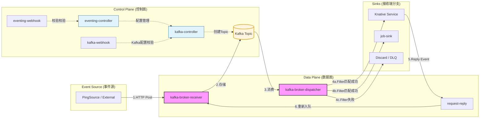
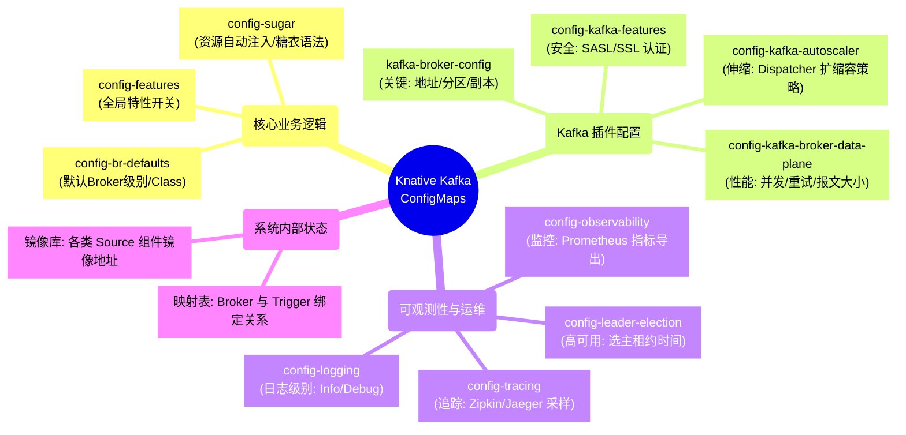

---
tags:
  - knative
id: 20260116113054
created: 2026-01-16 11:30:54
status:
  - pending
  - done
  - in_progress
type: fleet-note
aliases:
  - knative-eventing-gemeini
---
# 控制面和数据面

在 Knative Eventing 中，使用 Kafka 作为 Broker 是一种高性能、高可靠的方案。你提供的 Pod 列表涵盖了 **核心控制面**、**Kafka 适配控制面** 以及 **Kafka 数据面**。

为了让你清晰地理解它们，我将这些 Pod 按功能进行了归类说明，并梳理了完整的事件流转路径。

---

## 1. Pod 功能详细解析

### A. 核心控制面 (Core Control Plane)

这些组件负责管理 Knative 的基础资源（如 Trigger, Subscription, SinkBinding 等）。

|**Pod 名称**|**作用描述**|
|---|---|
|**eventing-controller**|**事件系统的大脑**。负责监控集群中的 CRD（如 Broker, Trigger），并根据配置创建相应的资源。它不处理具体的业务数据，只负责配置的同步。|
|**eventing-webhook**|**准入校验器**。当你通过 `kubectl apply` 创建 Knative 资源时，它负责校验配置的正确性，并为某些字段填充默认值（Mutation）。|

### B. Kafka 专用组件 (Kafka-Specific Components)

这些组件是 Knative Kafka Broker 实现的核心，负责将 Knative 的逻辑映射到 Kafka 内部（如 Topic 和 Consumer Group）。

|**Pod 名称**|**作用描述**|
|---|---|
|**kafka-controller**|**Kafka 逻辑控制器**。专门负责 Kafka 相关的资源调度。比如，当你创建一个 Kafka Broker 时，它会去 Kafka 集群里创建对应的 Topic。|
|**kafka-webhook-eventing**|**Kafka 专用准入校验**。校验与 Kafka 相关的配置（如 KafkaSource, Kafka Broker 配置项）。|

### C. 数据面 (Data Plane) - **这是最关键的部分**

这些 Pod 真正处理流经系统的每一个事件（CloudEvents）。

|**Pod 名称**|**作用描述**|
|---|---|
|**kafka-broker-receiver**|**事件入口（Ingress）**。它暴露一个 HTTP 端口，接收来自事件源（Source）的事件，并将其异步写入 Kafka 的特定 Topic 中。|
|**kafka-broker-dispatcher**|**事件分发器（Egress）**。它充当 Kafka 的消费者，从 Topic 中读取事件，根据 **Trigger** 的过滤条件，将事件通过 HTTP 推送给最终的订阅者（如 Ksvc）。|

### D. 辅助与特定功能组件

|**Pod 名称**|**作用描述**|
|---|---|
|**pingsource-mt-adapter**|**定时任务适配器**。如果你使用了 `PingSource`（类似 CronJob 发送事件），这个多租户（MT）适配器负责产生并发送这些定时事件。|
|**job-sink**|**任务接收端**。一种特殊的 Sink，允许事件触发后直接创建一个 Kubernetes Job 来运行一次性任务。|
|**request-reply**|**请求-响应管理器**。在需要同步返回结果（Request-Response 模式）的场景下，负责协调请求和响应的匹配。|

---

## 2. 完整事件流转 (Event Flow)

以下是一个事件从产生到被消费的完整链路，涵盖了从 Source 到 Kafka 再到 Sink 的所有分支：

### 流程阶段分解：

1. **事件产生阶段 (Ingress Branch)**:
    
    - **外部源/PingSource** 发送一个 HTTP 请求（CloudEvent 格式）。
        
    - 请求到达 **`kafka-broker-receiver`**。
        
    - Receiver 验证事件合法性，并根据 Broker 的配置，将事件写入 **Kafka Topic**。
        
2. **持久化与解耦 (Kafka Layer)**:
    
    - 事件在 Kafka Topic 中排队，确保了即使后端服务暂时不可用，事件也不会丢失。
        
3. **事件分发阶段 (Egress Branch)**:
    
    - **`kafka-broker-dispatcher`** 持续监听 Kafka Topic。
        
    - **逻辑判定**：Dispatcher 查看集群中定义的所有 **Trigger**。
        
    - **分支 A (匹配成功)**：如果事件属性符合 Trigger 的 `filter` 条件，Dispatcher 将事件通过 HTTP 发送到定义的 **Sink**（如 Ksvc, Service, 或 **Job Sink**）。
        
    - **分支 B (匹配失败)**：如果没有任何 Trigger 匹配，该事件通常会被丢弃（或进入死信队列，如果配置了的话）。
        
4. **响应处理阶段 (Reply Branch)**:
    
    - **分支 C (有返回值)**：如果 Sink 执行完后返回了一个新的 CloudEvent，该事件会回到 Dispatcher，Dispatcher 可能会将其发回给 Broker（根据配置），进入下一轮分发。
        
    - **分支 D (Request-Reply)**：如果使用了 **`request-reply`** 模式，它会确保响应能准确返回给最初的请求方。
        

---

### 总结建议

- **性能瓶颈** 通常出现在 `kafka-broker-receiver`（入口吞吐）和 `kafka-broker-dispatcher`（分发并发）。
    
- **排查问题** 时，如果是事件进不来，看 `receiver` 日志；如果是事件不触发，看 `dispatcher` 日志和 `Trigger` 的过滤条件。

**你想深入了解如何针对 `kafka-broker-dispatcher` 进行性能调优（比如增加并发数或分区数）吗？**

# Configmap

Knative Eventing 的 ConfigMap 数量众多，是因为它采用了**插件化**和**解耦**的设计。在 Kafka Broker 的场景下，这些配置主要分为：**核心通用配置**、**Kafka 插件专用配置**、以及**监控与可观测性配置**。

为了方便你查阅，我将这些 ConfigMap 按功能模块进行了归类：

---

## 1. 核心业务与逻辑控制 (Core Logic)

这部分 ConfigMap 决定了 Eventing 的基本行为，如默认使用哪种 Broker、是否开启某些实验性功能。

|**ConfigMap 名称**|**作用描述**|**核心配置项**|**应用场景**|
|---|---|---|---|
|**config-br-defaults**|定义 **Broker** 的默认全局设置。|`defaultConfig` (指定默认使用的 Broker Class)|当你只写 `kind: Broker` 而不指定 spec 时，系统根据此配置决定创建 Kafka Broker 还是其他类型。|
|**config-features**|控制 Eventing 核心特性的开关。|`multi-tenant`, `delivery-timeout-retry`|开启或关闭某些仍在 Beta 阶段的功能，如跨命名空间的事件引用。|
|**config-sugar**|“糖果”控制器配置，用于自动化。|`broker-class`, `injection-label`|实现“自动注入”，例如在 Namespace 上打个标签就自动创建一个 Broker。|
|**config-kreference-mapping**|资源引用映射配置。|`mapping`|允许 Knative 识别非标准 Kubernetes 资源的 URL 路径（Sink 映射）。|

---

## 2. Kafka 插件专用配置 (Kafka Specific)

由于你使用了 Kafka Broker，这组配置最为关键，直接影响 Kafka 的连接、性能和扩缩容。

|**ConfigMap 名称**|**作用描述**|**核心配置项**|**应用场景**|
|---|---|---|---|
|**kafka-broker-config**|**最核心配置**。定义如何连接 Kafka 集群。|`bootstrap.servers`, `replication.factor`, `default.topic.partitions`|修改 Kafka 地址、设置 Topic 的默认分区数和副本数。|
|**config-kafka-broker-data-plane**|**性能调优**。控制数据面（Receiver/Dispatcher）的参数。|`receiver.max-request-size`, `dispatcher.cpu.limit`|当你需要处理大报文，或需要调整分发器（Dispatcher）的并发处理能力时修改。|
|**config-kafka-autoscaler**|Kafka 组件的自动扩缩容策略。|`min-replicas`, `max-scraped-duration`|针对 Kafka 消费者组的积压情况，控制 Dispatcher Pod 的自动水平伸缩。|
|**config-kafka-features**|Kafka 插件的特定功能开关。|`auth.secret.type`, `sasl.mechanism`|配置 Kafka 的安全认证方式（SASL/SSL）时使用。|
|**config-kafka-source-defaults**|KafkaSource 的默认行为。|`consumerGroupId`, `fetchMinBytes`|当使用 KafkaSource 消费外部 Topic 时，定义默认的消费者组策略。|

---

## 3. 运维与可观测性 (Observability & Ops)

这部分负责系统的“透明度”，包括日志等级、监控指标和链路追踪。

|**ConfigMap 名称**|**作用描述**|**核心配置项**|**应用场景**|
|---|---|---|---|
|**config-logging**|全局日志配置。|`zap-logger-config` (level: info/debug)|需要排查组件为何报错时，将 level 改为 `debug` 以查看更详细日志。|
|**config-observability**|监控指标导出配置。|`metrics.backend-destination` (prometheus/statsd)|配置将监控数据发送到 Prometheus 或 Grafana。|
|**config-tracing**|链路追踪配置。|`backend` (zipkin/jaeger), `sample-rate`|追踪一个事件从进入 Receiver 到被 Sink 接收的全过程耗时。|
|**config-leader-election**|选主机制配置。|`leaseDuration`, `renewDeadline`|保证 controller 的高可用。在高并发集群中，若选主频繁超时导致组件重启，需调整此处。|

---

## 4. 内部状态与镜像映射 (Internal)

通常不建议手动修改，它们由系统自动维护或在安装时确定。

- **kafka-broker-brokers-triggers**: 这是一个动态存储的配置，记录了 Broker 和 Trigger 的映射关系，供 Dispatcher 快速查询。
    
- **eventing-integrations-images**: 定义了各种 Source（如 PingSource, ApiServerSource）对应的镜像地址。
    
- **istio-ca-root-cert / kube-root-ca.crt**: 证书配置，用于组件间的 TLS 安全通信。
    

---

## 💡 核心操作建议：如果你要调优 Kafka

在实际生产中，你最频繁修改的通常是以下两个：

1. **修改 `kafka-broker-config`**:
    
    - 如果你发现事件处理太慢，尝试增加 `default.topic.partitions`（分区数决定了并发上限）。
        
2. **修改 `config-kafka-broker-data-plane`**:
    
    - 调整 `dispatcher` 的 `max.poll.records`，可以控制一次从 Kafka 拉取多少条数据，从而平衡吞吐量和内存占用。
        

**你想让我为你展示一个具体的修改案例吗？比如：如何配置 Kafka 的 SASL 认证，或者如何增加 Broker 的默认分区数？**

# References
