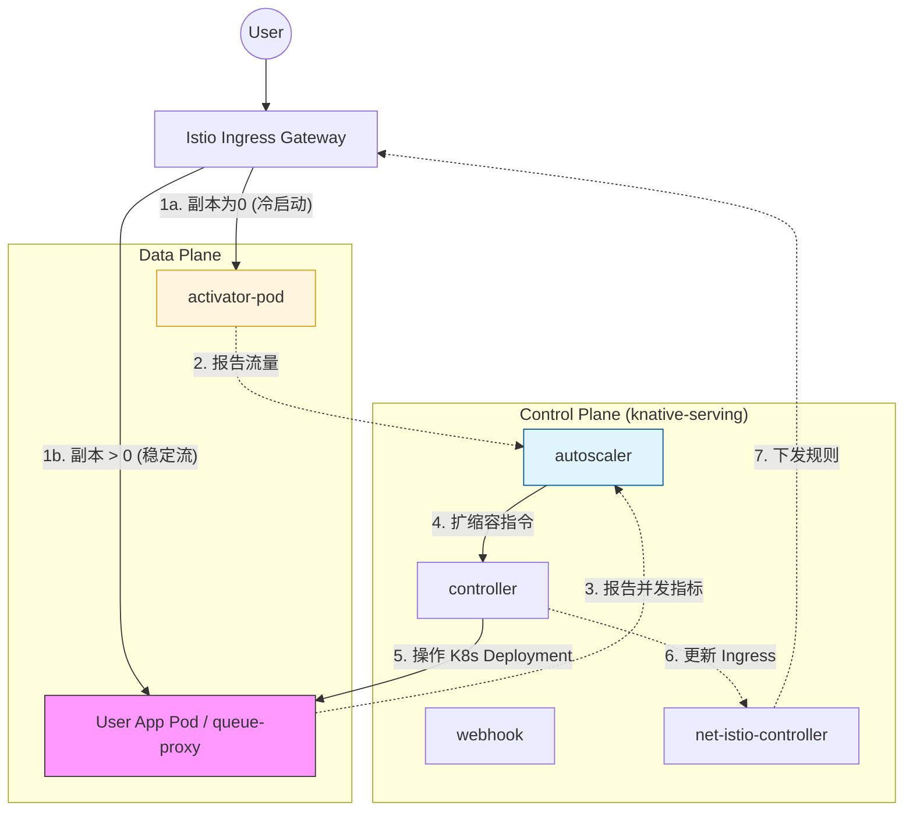
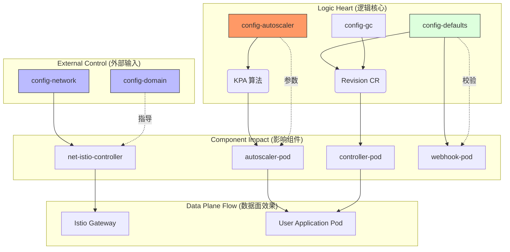

---
tags:
  - knative
id: 20260116145516
created: 2026-01-16 14:55:16
status:
  - pending
  - done
  - in_progress
type: fleet-note
aliases:
  - knative-serving-gemini
---
# 控制面和数据面

从 Knative Eventing 转向 Knative Serving，我们从“异步事件驱动”进入了“**同步请求驱动**”的世界。Knative Serving 的核心目标是管理 Pod 的生命周期，实现**自动扩缩容（Autoscaling）和缩容至零（Scale-to-Zero）**。

以下是对你提供的组件及其流转逻辑的深度解析。

---

## 1. Pod 功能详细解析

### A. 核心控制面 (Control Plane)

这些 Pod 负责维护 Knative 资源的状态逻辑，不直接参与业务流量的转发。

|**Pod 名称**|**核心作用**|**详细描述**|
|---|---|---|
|**controller**|**Serving 总管**|监听 Knative CRD（Service, Configuration, Revision, Route），负责将用户的意图转化为 K8s 底层资源（如 Deployment, Service）。|
|**webhook**|**配置校验器**|拦截所有对 Knative 资源的写请求，确保 YAML 配置合法，并设置默认参数（如默认并发限制）。|
|**autoscaler**|**扩缩容决策者**|**Knative 的灵魂**。它接收来自流量端的指标数据，根据设定的并发量或 RPS，决定 Revision 需要多少个 Pod。|

### B. 网络与网格适配 (Networking - Istio)

因为你使用了 Istio 作为网络层，这些 Pod 负责将 Knative 的路由规则“翻译”给 Istio。

|**Pod 名称**|**核心作用**|**详细描述**|
|---|---|---|
|**net-istio-controller**|**路由翻译器**|将 Knative 的 `Ingress` 资源转换为 Istio 的 `VirtualService` 和 `Gateway` 规则。|
|**net-istio-webhook**|**网络准入校验**|专门负责校验与 Istio 相关的网络配置项。|

### C. 数据面关键组件 (Data Plane)

|**Pod 名称**|**核心作用**|**详细描述**|
|---|---|---|
|**activator**|**冷启动“守门员”**|当 Pod 缩容至 0 时，它是流量的临时接收站。它会**缓存请求**并通知 Autoscaler 扩容，待 Pod 启动后再将请求转发出去。|

---

## 2. 完整请求流转逻辑 (Flow)

Knative Serving 的流程分为两条路径：**冷启动路径（从0到1）** 和 **热路径（稳定运行）**。

### 流程阶段分解：

1. **用户请求进入**: 流量首先到达 Istio Ingress Gateway。
    
2. **分支 A：冷启动 (Scale-to-Zero 状态)**
    
    - Istio 路由规则此时指向 **`activator-service`**。
        
    - **Activator** 接收到请求，发现后端没有 Pod，于是将请求**暂存在内存**中。
        
    - **Activator** 向 **Autoscaler** 发送信号：“有活来了，快起 Pod”。
        
    - **Autoscaler** 修改 Deployment 副本数，Pod 开始启动。
        
    - Pod 就绪后，**Activator** 将暂存的请求转发给真实的业务 Pod。
        
3. **分支 B：热路径 (稳定流量状态)**
    
    - 当 Pod 已经存在且足够处理当前流量时，**Autoscaler** 会通知网络层。
        
    - 流量会**绕过 (Bypass) Activator**，直接从 Istio Gateway 转发到业务 Pod（通过内网 LoadBalancer）。
        
4. **指标采集分支**:
    
    - 每个业务 Pod 里的 `queue-proxy` 容器（Sidecar）会不断统计并发量。
        
    - 这些数据被推送到 **Autoscaler**，用于判断下一步是继续扩容还是准备缩容。
        
5. **缩容分支**:
    
    - 如果长时间没有请求，**Autoscaler** 将副本数设为 0。
        
    - **Controller** 更新网络规则，将流量重新导向 **Activator**，循环回到状态 2。
        

---

## 3. Mermaid 架构图 (可导入 Excalidraw)

你可以将以下代码通过 "Mermaid to Excalidraw" 功能导入，以获得专业的架构图。

Code snippet

---

### 💡 核心运维建议

- **性能监控**：如果你发现冷启动非常慢，通常需要排查 `activator` 到 `autoscaler` 的通信延迟，或者应用镜像的大小。
    
- **流量突发**：如果你的业务有瞬间高并发，建议通过 ConfigMap 调整 `autoscaler` 的 `target-utilization-percentage`（默认 70%），预留更多缓冲。
    

**你想深入了解如何通过 ConfigMap 优化冷启动的时间（例如调整探针或扩容算法）吗？**

# Configmap

Knative Serving 的 ConfigMap 是整个无服务器框架的“治理中心”。相比 Eventing，Serving 的配置更侧重于**请求处理、扩缩容算法、以及网络路由**。

为了让你能够专业地管理这些配置，我将这些 ConfigMap 按功能划分为四个核心维度：

---

## 1. 核心行为与扩缩容 (Autoscaling & Lifecycle)

这部分是 Knative 的灵魂，直接决定了 Pod 什么时候启动、什么时候销毁。

|**ConfigMap 名称**|**作用描述**|**核心配置项**|**应用场景**|
|---|---|---|---|
|**config-autoscaler**|**KPA 算法配置**。控制扩缩容的灵敏度和并发目标。|`container-concurrency-target-default`: 每个 Pod 默认处理多少并发。      `stable-window`: 缩容决策的时间窗口（默认 60s）。|需要调整“冷启动”后的缩容速度，或改变默认并发负载时修改。|
|**config-defaults**|**Revision 默认值**。定义用户未指定时的容器配置。|`revision-timeout-seconds`: 请求超时时间。      `container-concurrency`: 强制并发上限。|全局限制所有服务的最大执行时间或内存/CPU 默认限制。|
|**config-gc**|**垃圾回收策略**。清理旧版本的 Revision。|`max-revisions-per-configuration`: 每个服务保留多少个旧版本。      `retain-since-create-time`: 保留多久以前创建的版本。|防止集群中积累过多的无用 Revision 资源，导致系统变慢。|
|**config-deployment**|**部署控制器行为**。控制 Sidecar 和进度监控。|`registries-skipping-tag-resolving`: 跳过 Tag 解析的仓库。      `queue-proxy-resource-defaults`: 注入的 queue-proxy 的资源配额。|优化内部组件的性能，或解决私有镜像仓库的解析问题。|

---

## 2. 网络、域名与证书 (Networking & Ingress)

控制服务如何暴露给外部，以及流量如何加密。

|**ConfigMap 名称**|**作用描述**|**核心配置项**|**应用场景**|
|---|---|---|---|
|**config-domain**|**域名映射**。定义 Ksvc 的访问地址后缀。|`example.com: ""` (空代表使用此主域名)。|将默认的 `example.com` 修改为公司内网域名或公网域名。|
|**config-network**|**全局网络策略**。定义 Ingress 类型和连接特性。|`ingress.class`: 默认的网关控制器（如 Istio）。      `external-domain-tls`: 是否开启外部流量 TLS。|切换底层网关（如从 Istio 换到 Contour），或强制 HTTPS 访问。|
|**config-istio**|**Istio 深度集成**。配置网关的具体路径。|`gateway.knative-serving.knative-ingress-gateway`: 指定 Istio 网关名称。|当你的 Istio Gateway 部署在非默认命名空间或有特定名称时使用。|
|**config-certmanager**|**证书自动管理**。控制 HTTPS 证书的签发。|`issuerRef`: 指定 Cert-Manager 的签发者。|实现自动化的免费 HTTPS 证书管理。|

---

## 3. 特性开关与治理 (Features & Governance)

|**ConfigMap 名称**|**作用描述**|**核心配置项**|**应用场景**|
|---|---|---|---|
|**config-features**|**功能实验开关**。开启或关闭 Knative 的非核心特性。|`multi-container`: 是否允许一个 Pod 运行多个容器。      `kubernetes.podspec-field-mask`: 允许修改的 Pod 字段限制。|需要使用 Sidecar 模式或某些高级 K8s 特性时开启。|
|**config-leader-election**|**高可用选主**。控制 Controller 的主从切换。|`leaseDuration`, `renewDeadline`。|在大规模集群中，防止网络波动导致控制器频繁重启。|

---

## 4. 运维全景 Flow (Excalidraw 格式 - Mermaid 代码)

你可以将此代码粘贴到 Excalidraw 的 **Mermaid to Excalidraw** 工具中，它展示了配置是如何影响数据流和控制流的。

Code snippet

---

### 💡 核心操作建议：如何“玩转”这些配置？

1. 快速自定义域名：
    
    执行 kubectl edit cm config-domain -n knative-serving，将 example.com 替换为 prod.company.com。
    
2. 解决并发性能瓶颈：
    
    如果你发现应用并发超过 100 就疯狂扩容，修改 config-autoscaler 中的 container-concurrency-target-default 为一个更大的值。
    
3. 强制冷启动测试：
    
    修改 config-autoscaler 的 scale-to-zero-grace-period 为 10s，你的应用在无流量 10 秒后就会缩容至零，方便测试启动速度。
    

**你是否需要我针对“如何优化冷启动时间”或者“如何配置自定义域名和 TLS”提供更具体的实战 YAML 案例？**

# References