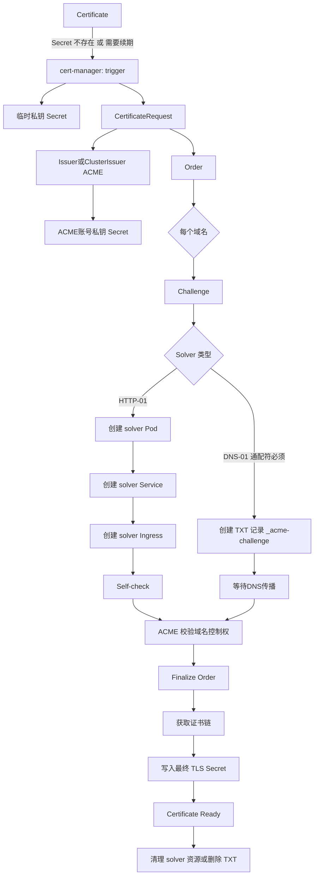

---
tags:
  - cert-manager
id: 20260116171837
created: 2026-01-16 17:18:37
status:
  - in_progress
type: fleet-note
aliases:
  - cert-manager-acme-apply-flow
---

Step 1: Pre-create the `Issuer` or `ClusterIssuer`
Step 2: User creates `Certificate`
Step 3: Cert Manager creates a temp private key.
Step 4: Create `CertificateRequest`
Step 5: ACME will create `Order`. Order is unchanged.
Step 6: Challenge for domain.
Step 7: HTTP01 or DNS01
Step 8: Order valid.
Step 9: Input secret. Mark ready.

# References