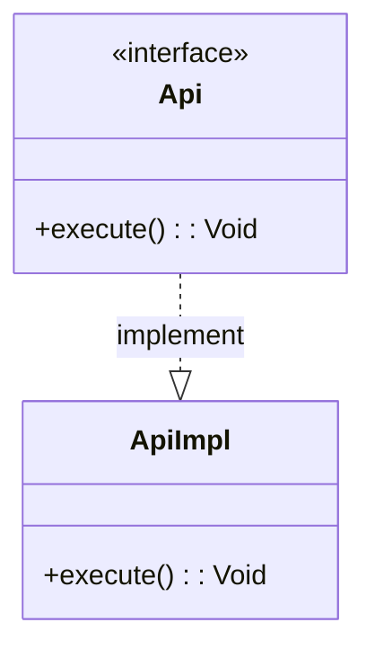
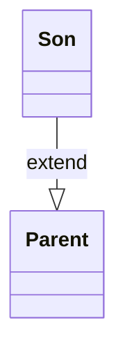
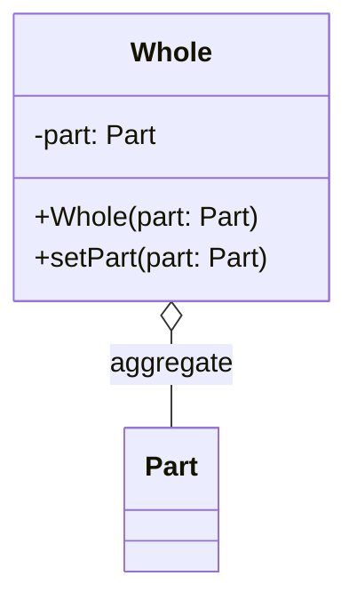
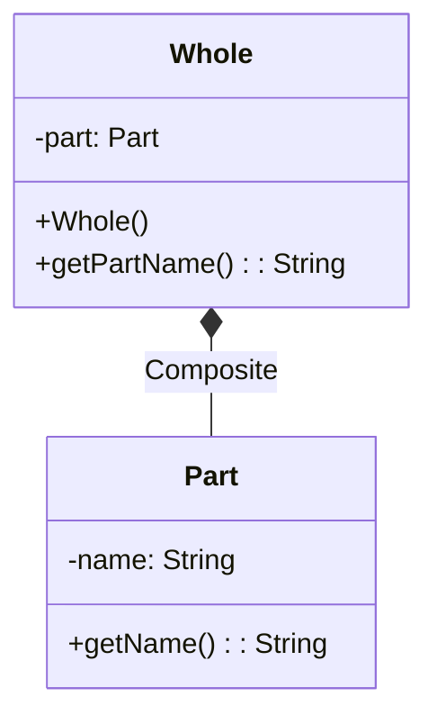
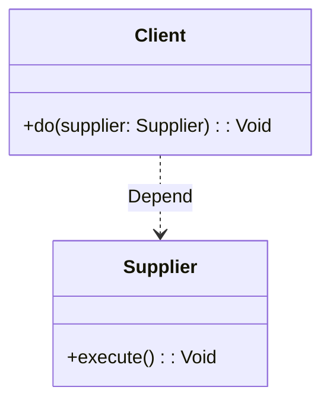

---
tags:
  - cheat-sheet
  - uml
  - mermaid
id: 20251228111430
created: 2025-12-28 11:14:30
status:
  - in_progress
type: cheat-sheet-note
aliases:
  - mermaid-uml
---

## Object Relationships
### Conclusion

|                      |      |
| -------------------- | ---- |
| Solid Line           | `--` |
| Dashed Line          | `..` |
| Open/Hollow Diamond  | `o`  |
| Solid/Filled Diamond | `*`  |
| Hollow Triangle      | \|>  |
| Arrow                | `>`  |

### Implementation

### Extend

### Aggregation

### Composition

### Dependency

