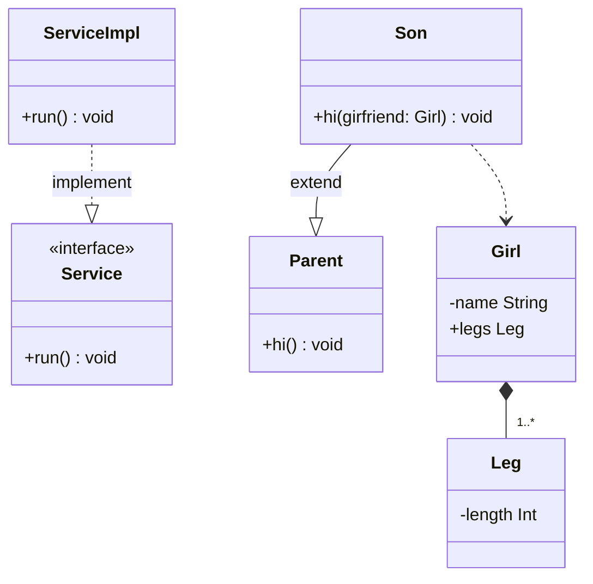

---
tags:
  - mermaid
  - cheat-sheet
id: 20251225223854
created: 2025-12-25 22:38:54
reviewed: false
status:
  - pending
  - done
  - in_progress
type: fleet-note
aliases:
  - mermaid-uml-cheat-sheet
---

聚合关系: `o--`

记忆口诀：
* 菱形是拥有者
* 空心聚合 `o--`
* 实心组合 `*--`
* 点是实现 `..|>`
* 线是继承 `--|>`
# References