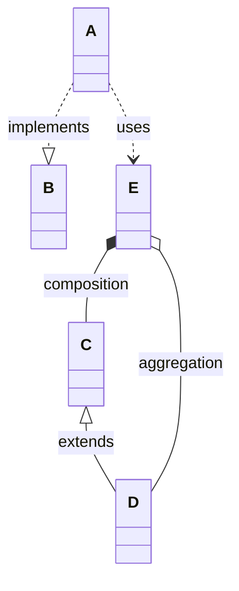

---
tags:
  - mermaid
  - cheat-sheet
id: 20251225223854
created: 2025-12-25 22:38:54
status:
  - pending
  - done
  - in_progress
type: fleet-note
aliases:
  - mermaid-uml-cheat-sheet
---

`--` 实线
`..` 虚线

- **继承**：`<|--` 三角形，像“is-a”
- **实现**：`..|>` 虚线 + 三角形，像“接口契约”
- **组合**：`*--` 星号像“拧死在一起”
- **聚合**：`o--` 圆圈像“松散装进来”
- **依赖**：`..>` 虚线箭头像“临时用一下” 
# References