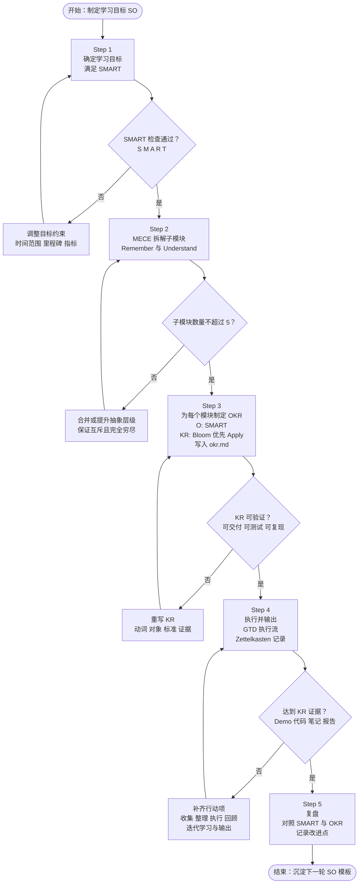

# Writing Learning Objective 
## Step 1: 确定满足 SMART 原则的学习目标

> [!EXAMPLE] 在一个月内搭建一个使用 RAG MCP Agent 的 LLM 编程助手应用

## Step 2: 使用 MECE 拆解出子模块 (mindmap) (remember + understand)

> [!TIP] 不要拆超出 5 个的子结构

> [!EXAMPLE] LLM Application
> * 模型与推理策略
> * 提示词与编排
> * RAG 检索增强
> * 工具与 Agent

## Step 3: 对每个模块制定 KR (okr.md)

* O 满足 SMART
* KR 满足 Bloom's Taxonomy
> [!TIP] 优先 Apply 级别，项目驱动学习

## Step 4: 执行并输出 (GTD + Zettelkasten )

> [!TIP] 卡片盒笔记法记录并产生输出

## Step 5: 复盘

# Flow

# References
* [[okr]]
* [[bloom's-taxonomy]]
* [[smart]]
